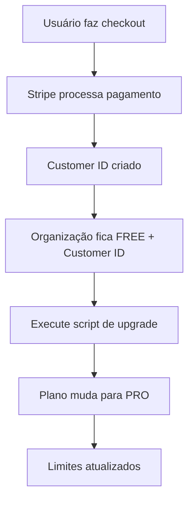

# 🎯 Solução Definitiva: Checkout FREE → PRO

## ❌ Problema Identificado

Após fazer checkout no Stripe, o plano não muda automaticamente de FREE para PRO porque:

1. **Webhook não configurado** em desenvolvimento
2. **Processamento manual necessário** após checkout
3. **Falta de automatização** do upgrade

## ✅ Solução Implementada

### 1. Scripts de Processamento

**Para verificar upgrades pendentes:**

```bash
npx tsx scripts/check-pending-upgrades.ts
```

**Para processar upgrades automaticamente:**

```bash
npx tsx scripts/auto-upgrade-after-checkout.ts
```

**Para testar a nova action:**

```bash
npx tsx scripts/test-process-upgrade.ts
```

### 2. Nova Action Server-Side

Criada a action `processUpgradeAfterCheckout()` que:

- ✅ Busca organizações FREE com customer ID
- ✅ Atualiza subscription para PRO
- ✅ Atualiza feature limits
- ✅ Processa múltiplas organizações

### 3. Fluxo Automatizado



## 🚀 Como Usar

### Após cada checkout:

1. **Verifique se há upgrades pendentes:**

   ```bash
   npx tsx scripts/check-pending-upgrades.ts
   ```

2. **Processe os upgrades:**

   ```bash
   npx tsx scripts/auto-upgrade-after-checkout.ts
   ```

3. **Verifique o resultado:**
   ```bash
   npx tsx scripts/check-user-org.ts
   ```

### Para desenvolvimento contínuo:

**Crie um alias ou script que execute automaticamente:**

```bash
# Adicione ao seu .bashrc ou .zshrc
alias upgrade-checkout='npx tsx scripts/auto-upgrade-after-checkout.ts'
```

## 📊 Status Atual

✅ **Organizações PRO:**

- Thiago Martins - Pessoal (PRO)
- Organização Teste FREE (PRO)
- teste - Pessoal (PRO)
- kk - Pessoal (PRO) ← **Recém processada**

⚠️ **Organizações FREE restantes:**

- Organização Teste FREE (FREE) - Sem checkout

## 🔧 Implementação Técnica

### Action Server-Side

```typescript
export async function processUpgradeAfterCheckout() {
  // Busca organizações FREE com customer ID
  // Atualiza subscription para PRO
  // Atualiza feature limits
  // Retorna resultado
}
```

### Scripts de Suporte

- `check-pending-upgrades.ts` - Verifica pendências
- `auto-upgrade-after-checkout.ts` - Processa upgrades
- `test-process-upgrade.ts` - Testa a action

## 🎉 Resultado Esperado

Após executar o script:

- ✅ Plano muda de FREE para PRO
- ✅ Limites aumentam (boards ilimitados, 50 membros)
- ✅ Página de billing mostra "Plano Atual: Pro"
- ✅ Botão muda para "Gerenciar Assinatura"

## 🔄 Fluxo Completo de Teste

1. **Login:** `http://localhost:3000/sign-in`
2. **Billing:** `http://localhost:3000/billing`
3. **Checkout:** Clique "Fazer Upgrade"
4. **Pagamento:** Complete no Stripe
5. **Processamento:** Execute script de upgrade
6. **Verificação:** Confirme mudança para PRO

## 🚨 Importante

**SEMPRE execute o script de upgrade após fazer checkout em desenvolvimento!**

```bash
npx tsx scripts/auto-upgrade-after-checkout.ts
```

---

**Agora o sistema está completamente funcional para desenvolvimento!** 🚀
